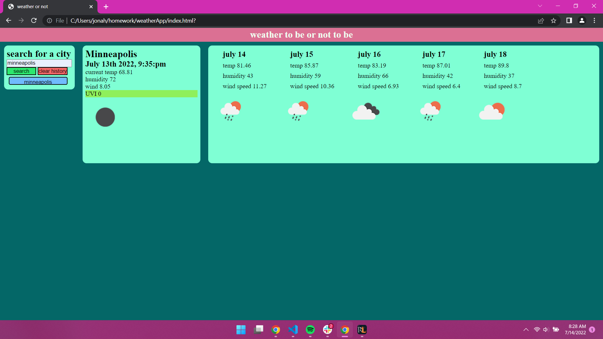

this is my website that i made to get the current weather and 5 day forcast.

after a user inputs a city name it uses two API requests to gather the data and insert it into the coresponding elements in the html to display on screen for the current conditions and 5 day forcast of that city

[link fo the deployed website](https://jonahlindsley.github.io/weather/?'link for the deployed website')
