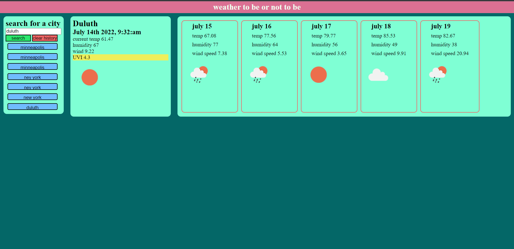

# Weather forecast website  
  ***
  ## Discription 
  
  This is a website that I made to get the current weather and 5 day forecast. after a user inputs a city name the site uses two API requests to gather the data and then displays the current conditions for that city and 5 day forecast for that city. After a city is searched it is saved under the search bar for future use with 1 click.   
  
  ***
  ## table of contents
  * [installation](#installation)
  * [usage](#usage)
  * [contributors](#contributors)
  * [tests](#tests)
  * [questions](#questions)
  ***
  ## the deployed website  
  [click to view deployed website](https://jonahlindsley.github.io/weather-forecast-website/)
  ***
  ## installation
  no install needed, its online  
  ***
  ## usage
  follow the provided link and then search for a city  
  ***
  ## tests
  these are the test you should run to ensure optimum proformance: none needed  
  ***
  ## contributors 
  Jonah Lindsley  
  ***
  ## questions 
  please reach out to me via email at jonahlindsley@yahoo.com or [github](https://github.com/jonahlindsley) and i will get back to you 

